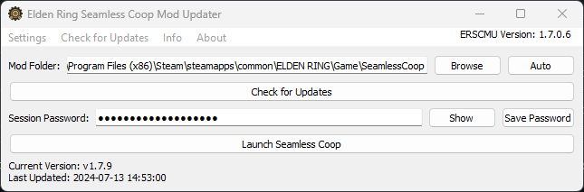
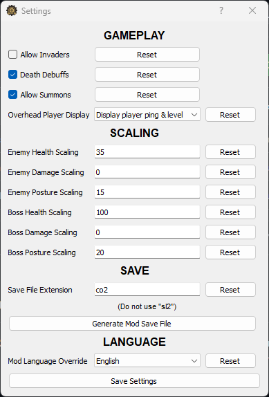
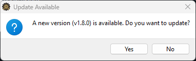
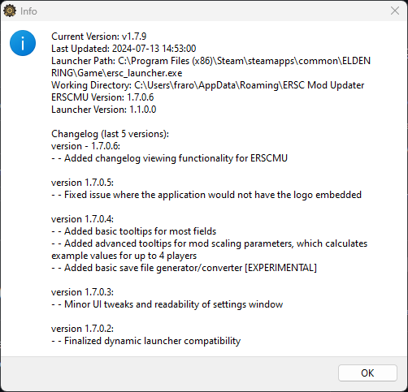
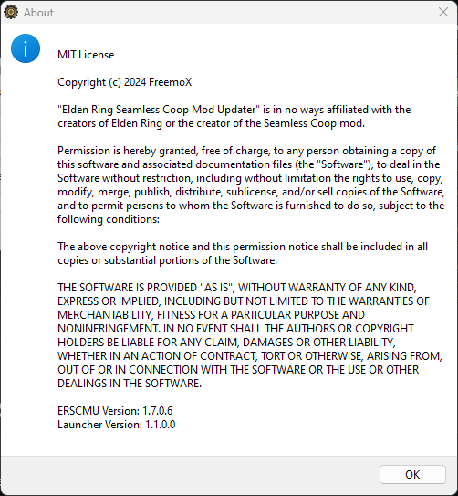

#  Elden Ring Seamless Coop Mod Updater (ERSCMU)

ERSCMU is a tool designed to help users keep their Elden Ring Seamless Coop mod up-to-date automatically. Users can download the exe installer from the releases tab, which fetches updated code, so users don't have to update the application manually for every update.  
  
_ERSCMU will **only update your mod**. If it's your first time installing Seamless Coop on your computer, you'll be prompted to [download the mod from Nexus Mods](https://www.nexusmods.com/eldenring/mods/510?tab=files).  
You can then select the mod file in the program, which will install it for you. All subsequent updates are done automatically.  
This was done in an effort to ensure the creator of Seamless Coop receives their Creator Rewards from Nexus Mods, since this is based on unique downloads (a users first time downloading a mod)._

## Features
- Automatically checks for the latest version of the Elden Ring Seamless Coop mod.
- Downloads and installs updates automatically.
- Backs up the previous version before updating.
- Allows configuration of mod settings through a GUI.
- Auto-discovers the mod installation path.
- Saves settings persistently in the AppData folder.
- Runs Seamless Coop properly, resolves the "Inappropriate Activity Detected" error.
- Allows for automatic Vanilla -> Mod save file conversion.
- Offers informative tooltips, including a scaling calculator.

## Installation

1. Download the `ERSCMU.exe` installer from the [Releases](https://github.com/FreemoX/ERSCMU/releases/latest) tab.  
   *You don't have to download the `ERSCMU.py` file. The launcher grabs this by itself from the latest release.*  
   _**Alternatively**, you can [build](https://github.com/FreemoX/ERSCMU?tab=readme-ov-file#building) the executable yourself to avoid issues with Windows Defender and anti virus software._
3. Run the downloaded `ERSCMU.exe` installer and follow the on-screen instructions.

## Usage

1. **Launching the Application**:
    - After installation, launch the Elden Ring Seamless Coop Mod Updater (ERSCMU) from your desktop or start menu.

2. **Initial Setup**:
    - On the first run, the application will check for updates automatically.
    - If the mod path is not detected, you can browse to the SeamlessCoop folder manually or use the auto-discover feature.

3. **Checking for Updates**:
    - Click on `Check for Updates` in the application menu or the main window to manually check for updates.

4. **Mod Configuration**:
    - Open the settings window through the `Settings` menu to configure mod settings.
    - Save your settings, and they will be applied the next time you launch the mod.

5. **Launching the Mod**:
    - Click on the `Launch Seamless Coop` button to start the mod with the configured settings.

## Configuration Files

- Configuration files are stored in the AppData folder: `C:\Users\<Your Username>\AppData\Roaming\ERSC Mod Updater`
- The main configuration file is `mod_updater_config.json`.

## License

```
MIT License

Permission is hereby granted, free of charge, to any person obtaining a copy of this software and associated documentation files (the "Software"), to deal in the Software without restriction, including without limitation the rights to use, copy, modify, merge, publish, distribute, sublicense, and/or sell copies of the Software, and to permit persons to whom the Software is furnished to do so, subject to the following conditions:

The above copyright notice and this permission notice shall be included in all copies or substantial portions of the Software.

THE SOFTWARE IS PROVIDED "AS IS", WITHOUT WARRANTY OF ANY KIND, EXPRESS OR IMPLIED, INCLUDING BUT NOT LIMITED TO THE WARRANTIES OF MERCHANTABILITY, FITNESS FOR A PARTICULAR PURPOSE AND NONINFRINGEMENT. IN NO EVENT SHALL THE AUTHORS OR COPYRIGHT HOLDERS BE LIABLE FOR ANY CLAIM, DAMAGES OR OTHER LIABILITY, WHETHER IN AN ACTION OF CONTRACT, TORT OR OTHERWISE, ARISING FROM, OUT OF OR IN CONNECTION WITH THE SOFTWARE OR THE USE OR OTHER DEALINGS IN THE SOFTWARE.
```

## Contributing
Contributions are welcome! Please fork the repository and submit a pull request for any improvements or bug fixes.  
This project is in no way affiliated with the creators of Elden Ring or the creator of the Seamless Coop mod.

## Building
Building the program yourself is a useful way of circumventing Windows Defender and antiviruses flagging ERSCMU as a virus.
1. Download [dynamic_launcher.py](dynamic_launcher.py) and [ERSCMU logo](assets/logo.ico) into a build directory (eg. `Documents\ERSCMU`).
2. Run `pip install requests PyQt5 pyinstaller` to install dependancies.
3. Run `pyinstaller --onefile --noconsole --icon=logo.ico dynamic_launcher.py --name ERSCMU` from within the directory you placed the files in.
4. You can now run the generated `ERSCMU.exe`. Enjoy not being pestered by false flags

## Disclaimer
ERSCMU is in no way affiliated with From Software, Elden Ring, or the Elden Ring Seamless Coop mod. This is just a personal project meant to provide a easy-to-use solution to manage the ERSC mod without having to edit files or mess with downloading and extracting files.

## Application Images





